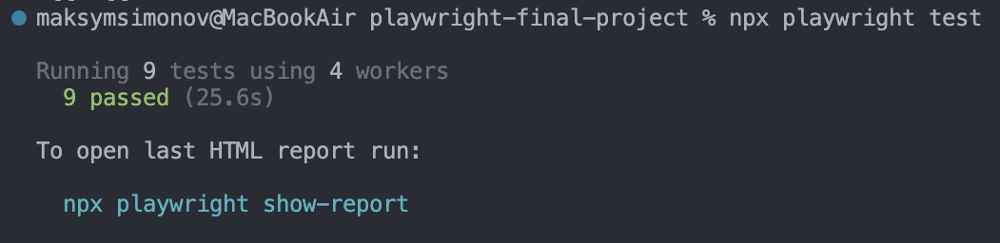

# playwright-final-project

Final project for YAJSC automation course using Playwright

## Requirements

* You should have any git client installed
* NodeJS 20 or higher
* VSCode

## Setup

#### 1. Clone the repository
```bash
git clone https://github.com/mxsimonov/playwright-final-project
```

#### 2. Install dependencies
```bash
npm install
```

#### 3. Install chromium browser
```bash
npx playwright install chromium --with-deps
```

#### 4. Create .env file based on .env-example file and add your creds
```bash
# .env-example
BASE_URL='https://practicesoftwaretesting.com'
USER_EMAIL='your_email_value'
USER_PASSWORD='your_password_value'
USER_NAME='your_username_value'
```

#### 5. OPTIONAL: Add GitHub Actions Secrets and Variables
```bash
# .github / workflows / playwright.yml
BASE_URL: ${{vars.BASE_URL}}
USER_EMAIL: ${{secrets.USER_EMAIL}}
USER_PASSWORD: ${{secrets.USER_PASSWORD}}
USER_NAME: ${{vars.USER_NAME}}
```

#### 6. Run tests
```bash
npx playwright test
```

You should see the next picture in case of success:
